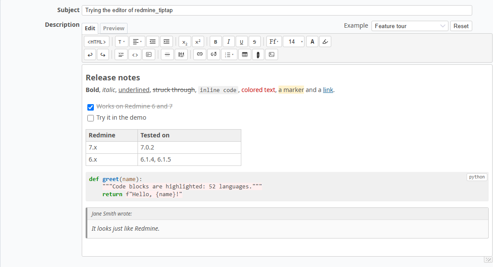

**Read this in other languages:**
[English](../README.md) ·
[Русский](README.ru.md) ·
[Shqip](README.sq.md) ·
[Azeri](README.az.md) ·
[Bosanski](README.bs.md) ·
[Български](README.bg.md) ·
[Català](README.ca.md) ·
[简体中文](README.zh.md) ·
[繁體中文](README.zh-TW.md) ·
[Hrvatski](README.hr.md) ·
[Čeština](README.cs.md) ·
[Dansk](README.da.md) ·
[Nederlands](README.nl.md) ·
[Eesti](README.et.md) ·
[Suomi](README.fi.md) ·
[Français](README.fr.md) ·
[Galego](README.gl.md) ·
[Deutsch](README.de.md) ·
[Ελληνικά](README.el.md) ·
[Magyar](README.hu.md) ·
[Bahasa Indonesia](README.id.md) ·
[Italiano](README.it.md) ·
[日本語](README.ja.md) ·
[한국어](README.ko.md) ·
[Latviešu](README.lv.md) ·
[lietuvių](README.lt.md) ·
[Монгол](README.mn.md) ·
[Norsk bokmål](README.no.md) ·
[Polski](README.pl.md) ·
[Português](README.pt.md) ·
[Português/Brasil](README.pt-BR.md) ·
[Română](README.ro.md) ·
[Srpski](README.sr-YU.md) ·
[Српски](README.sr.md) ·
[Slovenčina](README.sk.md) ·
[Slovenščina](README.sl.md) ·
[Español](README.es.md) ·
[Svenska](README.sv.md) ·
[ไทย](README.th.md) ·
[Türkçe](README.tr.md) ·
[Українська](README.uk.md) ·
[Tiếng Việt](README.vi.md)

> *Denne oversettelsen ble gjort med hjelp fra en AI-modell og har ikke blitt gjennomgått av en morsmålstaler. Hvis du finner en feil, vennligst [åpne et issue eller en pull request](https://github.com/Du10777/redmine_tiptap).*

Dette er en teksteditor for Redmine, basert på TipTap https://github.com/ueberdosis/tiptap

**[Prøv editoren på nett](https://du10777.github.io/redmine_tiptap/)**: demosiden kjører editoren i dette programtillegget rett i nettleseren din, på en side laget som et skjema i Redmine. Skriv og formater tekst, lim inn et bilde, åpne fanen «Forhåndsvis» for å se hvordan teksten vil se ut når den er lagret, bytt språk i grensesnittet eller velg en eksempeltekst. Ingenting å installere, og ingenting sendes noe sted.

[](https://du10777.github.io/redmine_tiptap/)

Editormotor: **TipTap 3.31.4**. Alle `@tiptap/*`-pakker er festet til denne eksakte versjonen i `package.json` og `package-lock.json` og må alltid oppgraderes sammen til samme versjon.

**Innhold**

- [Støttede Redmine-versjoner](#støttede-redmine-versjoner)
- [Funksjoner](#funksjoner)
  - [Tekstformatering](#tekstformatering)
  - [Lister](#lister)
  - [Tabeller](#tabeller)
  - [Bilder og vedlegg](#bilder-og-vedlegg)
  - [Kode](#kode)
  - [Blokker](#blokker)
  - [Redigering](#redigering)
  - [Integrasjon med Redmine](#integrasjon-med-redmine)
- [Syntaksfremheving](#syntaksfremheving)
- [Grensesnittspråk](#grensesnittspråk)
- [Installasjon](#installasjon)
- [Oppdatering](#oppdatering)
  - [Installert med git (anbefalt)](#installert-med-git-anbefalt)
  - [Installert fra et arkiv](#installert-fra-et-arkiv)
  - [Etter oppdatering](#etter-oppdatering)
- [Overgang fra CKEditor](#overgang-fra-ckeditor)

## Støttede Redmine-versjoner

| Redmine | Støttet | Testet på |
|---|---|---|
| 7.x | ja | 7.0.2 |
| 6.x | ja | 6.1.4, 6.1.5 |
| 5.x og eldre | nei | — |

En ny hovedversjon (8.x og senere) støttes først etter at programtillegget er testet på den. Inntil da starter ikke Redmine i den versjonen med programtillegget installert: den stopper med en feil som oppgir de støttede versjonene.

## Funksjoner

### Tekstformatering
- Fet, kursiv, understreket, gjennomstreket, subscript og superscript (Ctrl+, og Ctrl+.), inline-kode.
- Tekstfarge og bakgrunnsfarge: en palett med 64 farger eller en hvilken som helst heksverdi.
- Skrifttype (13 skrifttyper) og skriftstørrelse (forhåndsinnstillinger fra 8 til 72 piksler eller en hvilken som helst verdi).
- Avsnittsstiler: overskrifter 1–6 og normal tekst.
- Justering (venstre, sentrum, høyre, full) og innrykk (opptil 8 nivåer) av avsnitt og overskrifter.
- Lenker: sett inn, rediger, fjern.
- Vannrett linje, angre og gjør på nytt.

### Lister
- Punktlister med prikk, sirkel eller firkant-markører.
- Nummererte lister: 1, 01, a, A, i, I, α.
- Gjøremålslister med avmerkingsbokser; fullførte gjøremål er gjennomstreket.
- Nestede lister (Tab / Shift+Tab).

### Tabeller
- Sett inn en tabell av hvilken som helst størrelse, med eller uten headerrad.
- Høyreklikkmeny i en celle: legg til og slett rader og kolonner, slå sammen og del celler, headerrad og headerkolonne, slett tabellen.
- Kolonnebredder endres ved å dra cellegränser.
- Liming fra Excel bevarer kolonnebredder, justering og skriftstørrelser; en tabell kopiert fra Redmine limes inn i Excel med kanter.

### Bilder og vedlegg
- Lim inn et bilde fra utklippstavlen: det lastes opp som en vedlegg og vises i teksten.
- Bilder vedlagt med Redmines filfelt eller droppet på det settes inn i teksten også.
- Sett inn et bilde fra vedleggene (en miniatyrviser) eller en lenke til et vedlegg.
- Endre bildesstørrelse ved å dra hjørnene.

### Kode
- Kodeblokkjer med syntaksmarkering i editoren og på lagrede sider: 52 språk, og du kan legge til flere (se [Syntaksfremheving](#syntaksfremheving)).
- Språket i en blokk velges fra et badge i hjørnet, med søk, nylig brukte og hyppige språk.
- Tab og Shift+Tab innrykker og minsker linjer innenfor en kodeblokk; fet, lenker og farger i kode beholdes.

### Blokker
- Kollapsbar blokk: en tittel med skjult innhold (`<details>`). Lukket på lagrede sider, utvidet i editoren.
- Sitatblokk med forfatter- og datolin.

### Redigering
- `<HTML>`-modus for å vise og redigere HTML-kilden: nestede blokker er rykket inn, en tom linje skiller blokkene som går over flere linjer, syntaksen farges etter de samme reglene som i en HTML-kodeblokk, og Enter beholder innrykket på linjen.
- Markdown-stil skrivstil: `#` for overskrifter, `-` og `1.` for lister, `[ ]` for gjøremål, ```` ```python ```` for en kodeblokk (alle språknavn eller ingen), `**bold**`, `---` for en vannrett linje. Standardtastatursnarvei: Ctrl+B, Ctrl+I, Ctrl+U, Ctrl+Z og andre.
- Editoren blir aldri høyere enn vinduet: verktøylinjen og skjemaknappene forblir synlige, og teksten ruller innenfor. Høyden følger vinduesstørrelse og sideskalering.
- Et endringsgreb i nederste høyre hjørne stiller høyden manuelt inn. Høyden huskes; dobbeltklikk går tilbake til automatisk høyde.

### Integrasjon med Redmine
- Fungerer i alle Redmine-tekstfelt med formatering: sagsbeskrivelser og notater, wiki-sider, nyheter, forumbudskap, dokumenter, prosjektbeskrivelser, lange tekst-egendefinerte felt, inkludert felt som vises på siden senere.
- Tekst lagres som HTML. For å bruke editoren velger du *TipTap HTML* som tekstformatering i Redmine-innstillingene.
- Grensesnittet (verktøytips, menyer, dialoger) følger språket i brukerens Redmine-profil. 47 av de 50 Redmine-språkene kommer med programtillegget: engelsk og russisk er fullstendige, de øvrige 45 er utkast laget med en AI-modell som morsmålstalere gjerne kan korrigere. De tre språkene som skrives fra høyre til venstre (arabisk, hebraisk, persisk) støttes ikke bevisst (se [Grensesnittspråk](#grensesnittspråk)).
- Forblir raskt på store tekster: editorer i skjulte skjemaer opprettes bare når skjemaet åpnes, og lange kodeblokkjer fremheves når de ruller inn i synsfeltet.
- Tekster skrevet i CKEditor (programtillegget redmine_ckeditor) vises som de var og åpnes i editoren med formatteringen: ingen konvertering, se [Overgang fra CKEditor](#overgang-fra-ckeditor).
- Lagrede tekster vises uten usikker HTML: skript, hendelsesbehandlere og `javascript:`-lenker fjernes når en side vises, bare det editoren selv produserer beholdes. Dette dekker tekster som kommer gjennom REST API eller `<HTML>`-modus også.

## Syntaksfremheving

Kodeblokkjer fremheves i editoren og på lagrede sider på samme måte. Språket i en blokk velges fra badgene i det øverste høyre hjørnet; listen har en søkeboks og husker nylig og hyppig brukte språk.

52 språk kommer med programtillegget, inkludert HTML, 1C, Cisco IOS, MikroTik RouterOS, Windows cmd, docker compose, Linux-tjenestelogger og journalctl-utdata.

Du kan legge til dine egne språk. Hvert språk er en fil i mappen `highlight/`. En hvilken som helst av 190+-highlight.js grammars, eller en tredjepartsgrammatikk, konverteres til slik en fil med en kommando:

```sh
python3 highlight/_convert_grammar.py erlang
sh highlight/_compile.sh
```

Detaljer: [highlight/README/no.md](../highlight/README/no.md).

## Grensesnittspråk

Editoren taler språket valgt i brukerens Redmine-profil (Min konto → Språk). Filer for 47 av de 50 Redmine-språkene kommer med programtillegget i `config/locales/`. Engelsk er kilden og russisk er forfatterens eget; de øvrige 45 er utkast laget med hjelp fra en AI-modell og ikke ennå gjennomgått av morsmålstalere, så forventer du en merkelig setning her og der. En tekst som mangler fra en fil vises på engelsk.

For å korrigere en oversettelse endrer du verdiene i `config/locales/<code>.yml` (`de`, `fr`, `pt-BR`, ...) og starter Redmine på nytt. `bundle exec rake redmine_tiptap:locales` kontrollerer filene. Pull requests med rettelser er velkomne.

**Språkene som skrives fra høyre til venstre (arabisk, hebraisk, persisk) støttes ikke bevisst.** Å støtte dem krever mange endringer i kodebasen, ikke bare en oversettelse, og vi valgte ikke å ta det på oss. For disse språkene vises editoren på engelsk og oppsettet justeres ikke. Hvis du trenger et av dem, lag en fork: oversettelsesmekanismen er klar, og hva ellers må endres er oppført i [config/locales/README.md](../config/locales/README.md#right-to-left-languages).

Detaljer og liste over Redmine-språk: [config/locales/README.md](../config/locales/README.md).

## Installasjon

1. Sett programtillegget i Redmines mappe `plugins`. Mappen må hete `redmine_tiptap`. Den enkleste måten er git, som gjør oppdateringer til en kommando:
   ```sh
   cd /path/to/redmine
   git clone --branch release --single-branch --depth 1 https://github.com/Du10777/redmine_tiptap.git plugins/redmine_tiptap
   ```
   Grenen `release` har bare filene programtillegget trenger for å kjøre, uten denne dokumentasjonen, og `--depth 1` henter ikke historikken til depotet.
2. Start Redmine på nytt.
3. I Redmine-innstillingene (redmine.selfhosted/_settings_) velger du Tekstformatering: *TipTap HTML*.

## Oppdatering

Programtillegget har ingen databasemigrasjoner, og det innbundne JavaScript-buntet og stilarket er en del av arkivet. Oppdatering krever ikke npm eller et bygg på serveren: erstatt programtilleggfilene og start Redmine på nytt.

Før oppdatering kontrollerer du at den nye versjonen støtter din Redmine-versjon (se "Støttede Redmine-versjoner" ovenfor).

### Installert med git (anbefalt)

```sh
cd /path/to/redmine/plugins/redmine_tiptap
git pull
```

Start deretter Redmine på nytt, for eksempel:

```sh
sudo systemctl restart redmine          # Redmine kjørende som en systemd-tjeneste
touch /path/to/redmine/tmp/restart.txt  # Passenger
docker compose restart redmine          # Docker
```

For å holde deg på en bestemt versjon i stedet for den nyeste, hent en commit fra grenen `release` og bytt til den: `git fetch --depth 1 origin <commit> && git checkout <commit>`.

Hvis programtillegget ble installert med en vanlig `git clone` (grenen `main`, med dokumentasjonen og hele historikken), bytter du til grenen `release` én gang: slett mappen `plugins/redmine_tiptap` og installer programtillegget på nytt som beskrevet i [Installasjon](#installasjon). Programtillegget lagrer ikke noe eget i mappen sin, så ingenting går tapt; bare språk for syntaksfremheving som du har lagt til selv, må først kopieres ut av `highlight/`.

### Installert fra et arkiv

1. Last ned `redmine_tiptap.zip` fra den nyeste utgivelsen: https://github.com/Du10777/redmine_tiptap/releases/latest/download/redmine_tiptap.zip. Den har de samme filene som grenen `release` (programtillegget uten denne dokumentasjonen). Slett den gamle mappen `plugins/redmine_tiptap` og pakk ut arkivet på samme sted; mappen inni heter allerede `redmine_tiptap`. Når den slettes først, blir ikke filer som er fjernet i den nye versjonen, liggende igjen.
2. Slett `public/assets/.manifest.json` i Redmine-mappen.
3. Start Redmine på nytt.

Trinn 2 betyr noe. Ved oppstart gjenleggs Redmine-programtilleggets eiendeler bare hvis filene deres er nyere enn dette manifestet. Filer pakket ut fra et arkiv beholder sine opprinnelige tidsstempler, så uten trinn 2 kan Redmine fortsette å servere den gamle editoren. Manifestet gjenopprettes automatisk ved oppstart. Med `git pull` er dette trinnet ikke nødvendig: git gir endrede filer det nåværende tidsstemplet.

### Etter oppdatering

- Editorens skript og stilark serveres med et innholdsfingeravtrykk i URL-adressene, så nettlesere laster den nye versjonen rett etter omstarten. Brukere trenger ikke å tømme nettlesercachen.
- Hvis *Mellomlagre formattert tekst* er aktivert i Redmine-innstillingene (Administrasjon → Innstillinger → Generell), tøm Redmines hurtigminne en gang etter oppdatering til en versjon som endrer hvordan tekster vises (HTML-rensing, støtte til CKEditor-tekster): `bundle exec rake tmp:cache:clear RAILS_ENV=production` i Redmine-mappen. Ellers kan sider gjengitt før oppdateringen vises fra hurtigminnet, urenset, til teksten endres.
- Tidligere versjoner av programtillegget kopierte skriptet til `public/tiptap_bundle.js`. Disse filene brukes ikke lenger og kan slettes:
  ```sh
  rm -f /path/to/redmine/public/tiptap_bundle.js /path/to/redmine/public/tiptap_bundle.js.map
  ```

## Overgang fra CKEditor

Hvis din Redmine brukte [redmine_ckeditor](https://github.com/a-ono/redmine_ckeditor), kan du bytte til dette programtillegget og beholde hver tekst som er skrevet: sager, notater, wiki-sider, nyheter, meldinger, dokumenter. Ingenting konverteres og databasen berøres ikke. CKEditor lagrer tekstene som HTML, og det gjør dette programtillegget også, så en lagret tekst vises ganske enkelt av den nye formatteren.

1. Installer programtillegget (se ovenfor) og velg Tekstformatering: *TipTap HTML*.
2. Behold mappen `public/system/rich/` på din Redmine. Hvis folk satte inn bilder og filer med CKEditors bildevelger, lagres de der, ikke i databasen og ikke blant vedleggene, og tekstene refererer til dem etter adresse (`/system/rich/...`). **Hvis Redmine flyttes til en annen server eller settes opp på nytt, flytt også denne mappen**, sammen med databasen og mappen `files/`: ingen av dem inneholder disse filene, og uten mappen gir bildene i gamle tekster en 404-feil. Vedlegg av sager, wiki-sider osv. lagres som før og trenger ingenting. Bilder som settes inn i denne editoren, er vanlige vedlegg. Mappen er fortsatt nødvendig etter at redmine_ckeditor er fjernet.
3. Fjern redmine_ckeditor når du ikke lenger trenger det.

En gammel tekst vises som CKEditor viste den: skrifttyper, størrelser, farger og justering, innrykk, lister, tabeller (kanter, bredder, bildetekster, sammenslåtte celler), bilder (størrelse, flyte, kant, et bilde innenfor en lenke), lenker, kodeblokkjer med språket (fremhevet), Redmine-makroer (`{{toc}}`, `{{collapse(Title) ... }}`, `{{thumbnail(...)}}` og så videre), wiki- og sagslenker, rene webadresser gjort klikbare og innebygd `<iframe>` (video). En tekst skrevet i CKEditor gjenkjennes av oppsettet og beholder avstanden mellom avsnitter som den hadde der, som er bredere enn i denne editoren.

Forskjeller med hensikt:
- En `<iframe>` vises bare når den peker på et annet nettsted over http(s), og den er sandboxet: siden innenfor kan kjøre sine egne skript, men kan ikke nå Redmine-siden, åpne toppvinduet eller sende skjemaer. Alle andre `<iframe>` fjernes.
- Lenker åpnes i samme vindu: `target`-attributten for en lenke (CKEditors "Nytt vindu (_blank)") beholdes ikke.
- En viss formatering som CKEditor tilbød men sidene taust droppet vises her: for eksempel bakgrunnsfarger på "Merke"-stilene og sitattegnene for `<q>`.
- Stilen "Special Container" i CKEditor (en blokk med grå ramme) vises som en kodeblokk uten syntaksmarkering, og i editoren er den også en kodeblokk.

En gammel tekst beholder formatteringen når den åpnes i editoren og lagres på nytt: Redmine-makroer (en makro er ett grått element i editoren; rediger det i `<HTML>`-modus som i CKEditors kildekode-modus), `<iframe>`, `<div>`- og `<address>`-blokker med stilen sin (en `<div>` som limes inn fra en nettside, blir fortsatt til et avsnitt), subscript og superscript, CKEditors inline-stiler (stor, liten, tastatur, prøve osv.), stilen på overskrifter, tabeller og tabellceller, størrelse (bredde og høyde), flyte, kant og lenke av bilder, språket i kodeblokker. Hva som ikke overlever redigering: tabellens bildetekst blir et sentrert avsnitt over den, tabellhodet og footerseksjoner blir ordinære rader (foteren forblir på bunnen), og `<del>` blir `<s>` (samme utseende). En tekst lagret fra denne editoren får den kompakte avsnittsavstanden i denne editoren.
